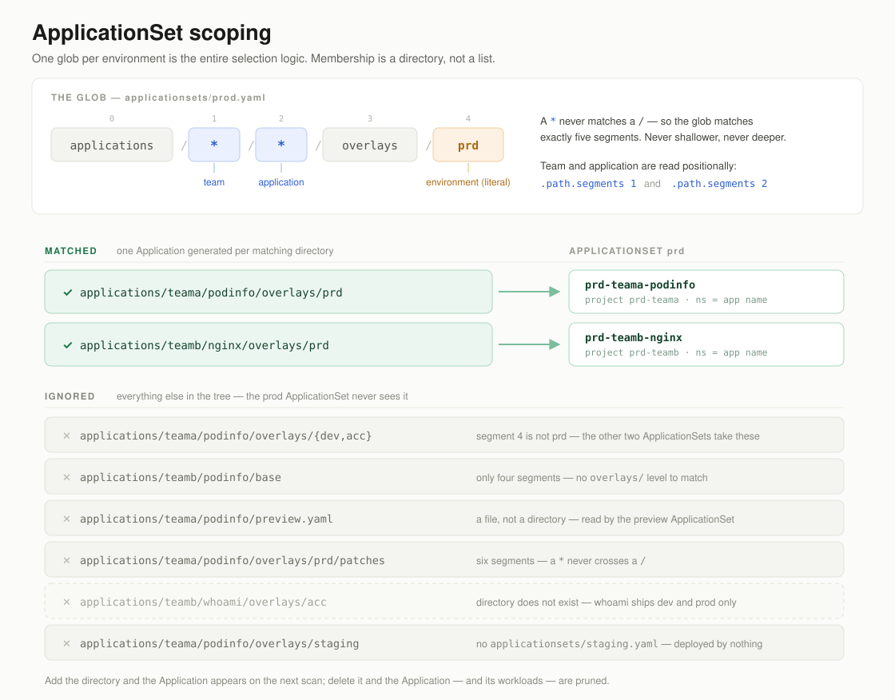
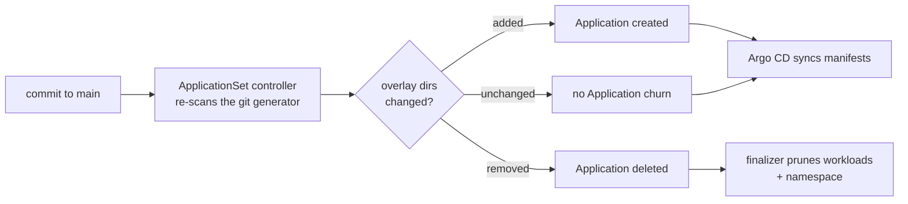
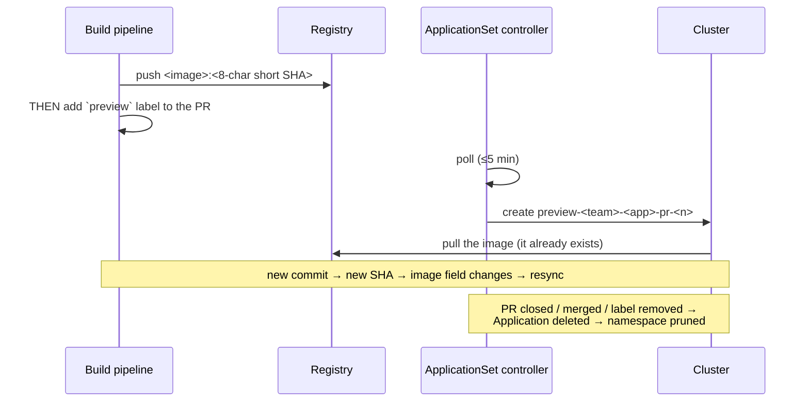

# ApplicationSets

> Who owns this file: the **platform team**. Application teams never edit
> `applicationsets/`; they add directories under `applications/` and are
> discovered automatically.

## What they are here

An ApplicationSet is a controller-side template: a *generator* prduces a set of
parameters, and one Argo CD `Application` is rendered per parameter set. This
repository runs **one ApplicationSet per environment, spanning every team** —
not one per team.

| File | Name | Generator | prduces |
| ---- | ---- | --------- | -------- |
| `applicationsets/dev.yaml` | `dev` | git directories, `applications/*/*/overlays/dev` | `dev-<team>-<app>` |
| `applicationsets/acc.yaml` | `acc` | git directories, `applications/*/*/overlays/acc` | `acc-<team>-<app>` |
| `applicationsets/prd.yaml` | `prd` | git directories, `applications/*/*/overlays/prd` | `prd-<team>-<app>` |
| `applicationsets/preview.yaml` | `preview` | matrix: `applications/*/*/preview.yaml` × open labelled PRs | `preview-<team>-<app>-pr-<n>` |

All five live in the `argocd` namespace, run `goTemplate: true` with
`goTemplateOptions: [missingkey=error]`, and template Applications that carry
the `resources-finalizer.argocd.argoproj.io` finalizer.

## The discovery mechanism

The whole selection logic is one glob:

```yaml
directories:
  - path: applications/*/*/overlays/prd
```



A `*` never matches a `/`, so the pattern matches exactly five path segments and
can only land on a directory literally named `prd`, two levels below
`applications/`. Consequences worth stating explicitly:

- **Membership is a directory, not a list.** Nothing enumerates applications.
  Creating `applications/<team>/<app>/overlays/prd` enrols the app in prd;
  deleting it removes the Application.
- **New teams need no ApplicationSet change.** The first `*` already matches any
  team directory. (They *do* need AppProjects — see
  [appprojects.md](appprojects.md).)
- **An application is only in the environments it ships an overlay for.**
  `devfront/whoami` has `overlays/dev` and `overlays/prd` only, so the `acc`
  and `nonprd` ApplicationSets simply never see it. That is the promotion
  model: no flag, no enable list, just the presence of a directory.

### Identity is positional

The generator exposes the matched path as `.path.segments`. For
`applications/teama/podinfo/overlays/prd` that is
`[applications, teama, podinfo, overlays, prd]`, so the template reads:

```yaml
name:      'prd-{{ index .path.segments 1 }}-{{ index .path.segments 2 }}'
project:   'prd-{{ index .path.segments 1 }}'
namespace: 'prd-{{ index .path.segments 1 }}-{{ index .path.segments 2 }}'
```

Index 1 is the team, index 2 is the application. Neither is read out of the
overlay's own manifests. **An application therefore cannot claim a different
team, project or namespace by editing its YAML** — only by moving directory,
which is a reviewable change to the tree. This is the property the whole
security model rests on; see [appprojects.md](appprojects.md).

`preview.yaml` matches one level shallower (`applications/<team>/<app>`), so its
segments are `[applications, <team>, <app>]` — indices 1 and 2 mean the same
thing.

### Namespace convention

Every Application deploys to `<environment>-<team>-<application>`, with
`CreateNamespace=true`. Overlays deliberately **do not** set `namespace:` in
their `kustomization.yaml`: the destination namespace is owned by the
ApplicationSet, and setting it in kustomize too would let the two drift apart
silently.

## Lifecycle

### 1. Bootstrap — how the ApplicationSets themselves get deployed

`bootstrap/root.yaml` is an app-of-apps, applied by hand exactly once:

```bash
kubectl apply -f bootstrap/root.yaml
```

It contains two Applications in the `default` project:

| Application | sync-wave | path | recurse |
| ----------- | --------- | ---- | ------- |
| `root-projects` | `-1` | `projects` | `true` (per-team subdirectories) |
| `root-applicationsets` | `0` | `applicationsets` | `false` (flat) |

The waves matter: AppProjects must exist before the ApplicationSets generate
Applications referencing them. From that point on both directories are managed
by Argo CD itself — a commit to `applicationsets/` is applied by
`root-applicationsets`, which is the only supported way to change them. Do not
`kubectl edit` an ApplicationSet; `selfHeal: true` reverts it.

Requires the ApplicationSet controller (ships with Argo CD 2.3+).

### 2. Steady state — what triggers a re-scan



Two independent loops, and confusing them is the usual source of "why hasn't my
change landed":

- **The generator loop** decides *which Applications exist*. The git generator
  re-scans on its requeue interval (≈3 minutes by default) or immediately on a
  repo webhook if Argo CD is wired to one. Only directory *structure* matters
  here — editing a file inside an existing overlay changes nothing for this loop.
- **The Application loop** decides *what each Application deploys*. Argo CD
  polls the repo on its own reconciliation timeout (`timeout.reconciliation` in
  `argocd-cm`, 3 minutes by default) or on webhook, renders the overlay, and
  syncs. With `automated: {prune: true, selfHeal: true}` this needs no human
  action, and manual drift in the cluster is reverted.

Confirm the intervals against your own installation — both are configurable and
a webhook changes the answer to "instant".

### 3. Ownership and deletion

Generated Applications carry an `ownerReference` to their ApplicationSet, and
the ApplicationSet controller runs the default `sync` policy: it creates,
updates **and deletes** Applications to match the generator output. Combined
with the `resources-finalizer` on each Application, deletion cascades all the
way to the running workloads:

| You do | Effect |
| ------ | ------ |
| Delete `applications/<team>/<app>/overlays/prd` | `prd-<team>-<app>` deleted → its workloads and namespace pruned |
| Delete the whole `applications/<team>/<app>/` | The app disappears from every environment at once |
| Delete `applicationsets/prd.yaml` | `root-applicationsets` prunes the ApplicationSet → **every** prd Application cascade-deleted → every prd workload pruned |
| `kubectl delete applicationset X --cascade=orphan` | ApplicationSet gone, Applications survive unowned |

The third row is the dangerous one, and it is why `applicationsets/prd.yaml`
carries a commented-out escape hatch:

```yaml
# syncPolicy:
#   preserveResourcesOnDeletion: true
```

Enabling it keeps workloads running when an Application stops being generated.
It trades safety against accidental deletion for safety against drift — orphaned
resources then linger and no longer track git.

To restructure or rename ApplicationSets without an outage, **orphan first, push
second**:

```bash
kubectl delete applicationset -n argocd <old-names...> --cascade=orphan
```

The Applications survive; the replacement ApplicationSets adopt them by name on
the next scan and reclaim the `ownerReference`. This is exactly the procedure
used when this repo consolidated from per-team ApplicationSets
(`<env>-<team>`) to per-environment ones.

### 4. The preview ApplicationSet's lifecycle

`preview` is the one ApplicationSet whose output is not a function of this repo
alone. It is a **matrix** of two generators:

1. `files: applications/*/*/preview.yaml` — which applications opted in, and
   which Azure teamaps repo holds their source. The file's keys
   (`azureteamapsProject`, `azureteamapsRepo`, `image`) become template parameters.
2. `pullRequest.azureteamaps` — the open pull requests of *that* repo, filtered to
   those carrying the `preview` label, polled every `requeueAfterSeconds: 300`.



Lifecycle points specific to previews:

- **The label is the gate, and its ordering is the contract.** Push the image
  *then* label the PR. Reversed, the preview sits in `ImagePullBackOff` until the
  push lands.
- **The tag length must match the pipeline.** `head_short_sha` is 8 characters;
  use `head_short_sha_7` or `head_sha` otherwise. A mismatch is not an error, it
  is an `ImagePullBackOff`.
- **Polling only, ~5 minutes.** The PR generator supports webhooks for GitHub and
  GitLab, but not Azure teamaps. `requeueAfterSeconds: 300` *is* the feedback
  loop. Lowering it multiplies API calls by the number of opted-in repositories
  against a single PAT's rate limit.
- **Namespaces are pruned on close.** `CreateNamespace=true` alone leaves an
  untracked namespace behind per closed PR; `managedNamespaceMetadata` makes the
  Namespace a managed resource so it dies with the Application.
- **Manifests always come from `main`.** The pull request lives in the
  application's *source* repo and contributes exactly one thing: a commit SHA.
  Previews render the **dev overlay verbatim** — no ephemeral overlay is ever
  committed, so previews cannot leave dead directories behind.
- **Blast radius is shared.** One matrix generator spans every team under
  `missingkey=error`, so a single malformed `preview.yaml` fails the generator
  and takes *every* team's previews down. `scripts/validate.sh` treats this as a
  hard failure, not a warning.

## Changing an ApplicationSet

| Change | What to do |
| ------ | ---------- |
| New environment | Copy any `applicationsets/<env>.yaml`; replace the glob's env, the name, the `environment` label, the templated project prefix and the namespace prefix. Then add `projects/<team>/<env>.yaml` for **every** team. |
| Gate prd behind manual approval | Delete the `automated:` block from `applicationsets/prd.yaml`. Applications are still generated; they just wait for an explicit sync. |
| New team | Nothing here. Only `projects/<team>/` — see [appprojects.md](appprojects.md). |
| New application | Nothing here. Only `applications/<team>/<app>/` — see [onboarding.md](onboarding.md). |

Run `./scripts/validate.sh` before committing any of it.
