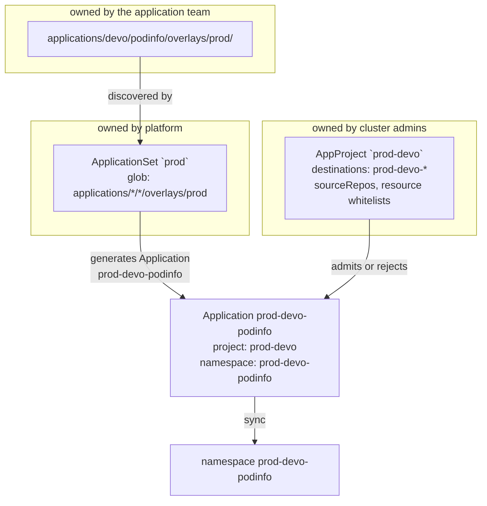

# AppProjects — the policy plane

> Who owns this directory: **cluster administrators**. `projects/` is the
> boundary between what application teams may declare and what the platform
> permits. Application teams should not be able to merge changes to it — enforce
> that with `CODEOWNERS` or branch protection.

## The split

ApplicationSets are *mechanism*: they decide which Applications exist and what
they are named. AppProjects are *policy*: they decide what those Applications
are allowed to do. The two are deliberately owned by different people and live
in different directories.

| Directory | Owner | Answers |
| --------- | ----- | ------- |
| `applications/<team>/<app>/` | the application team | what is deployed |
| `applicationsets/` | platform | how applications are discovered and templated |
| `projects/<team>/<env>.yaml` | **cluster admins** | what a team is permitted to deploy, and where |
| `bootstrap/root.yaml` | platform | how the two above get into the cluster |

There is one AppProject per **team per environment**, named `<env>-<team>`:

```
projects/
  devo/     dev.yaml  integ.yaml  nonprod.yaml  prod.yaml   → dev-devo … prod-devo
  devfront/ dev.yaml  integ.yaml  nonprod.yaml  prod.yaml   → dev-devfront … prod-devfront
```

Splitting by environment as well as by team is what allows prod to be governed
differently from dev for the same team — stricter resource whitelists, sync
windows, required signatures, a narrower set of Argo CD roles — without touching
the team's manifests.

## How an Application is bound to a project

The environment ApplicationSet templates the project name positionally, from the
directory hierarchy:

```yaml
project: 'prod-{{ index .path.segments 1 }}'
```

Index 1 is the team directory. This is the load-bearing detail: **the project is
derived from where the manifests live, not from anything the team writes.** A
team cannot point its Application at another team's project, or at `default`, by
editing a file it owns. The only way to change project is to move the
application's directory, which is a visible change to the tree in review.

The AppProject then closes the loop:

```yaml
destinations:
  - server: https://kubernetes.default.svc
    namespace: 'prod-devo-*'
```

A prod devo Application physically cannot sync anywhere but a `prod-devo-*`
namespace — not into `prod-devfront-*`, not into `kube-system` — even though a
single `prod` ApplicationSet now spans every team. The namespace convention
`<env>-<team>-<app>` is not merely followed, it is *enforced*, and the
enforcement lives in the file cluster admins own.



## What a cluster admin controls in `projects/<team>/<env>.yaml`

Currently set:

| Field | Current value | What it buys |
| ----- | ------------- | ------------ |
| `sourceRepos` | this repo only | Applications cannot render manifests from an arbitrary repo or Helm registry |
| `destinations` | `<env>-<team>-*` on the in-cluster API server | the namespace guardrail above; also pins the target cluster |
| `clusterResourceWhitelist` | `'*'/'*'` | **wide open** — see below |
| `namespaceResourceWhitelist` | `'*'/'*'` | **wide open** — see below |

The whitelists are permissive on purpose in this template, so the repo works out
of the box. Tightening them is the first thing to do on a real cluster:

```yaml
# Forbid cluster-scoped resources entirely, except the Namespace that
# CreateNamespace=true has to create.
clusterResourceWhitelist:
  - group: ''
    kind: Namespace
```

Keep `Namespace` allowed, or `CreateNamespace=true` fails on first sync of every
Application in that project.

Fields not used here that are worth knowing about, all of them admin-side levers
that need no change from application teams:

- **`roles`** — project-scoped Argo CD RBAC and JWT tokens; e.g. a team gets
  `sync` on `dev-devo/*` but only `get` on `prod-devo/*`.
- **`syncWindows`** — deny windows on `prod-*` projects (change freeze, business
  hours), optionally blocking manual syncs too.
- **`signatureKeys`** — require commits to be signed by a known GPG key before
  the project's Applications will sync.
- **`orphanedResources`** — warn when a namespace contains resources Argo CD does
  not manage.
- **`clusterResourceBlacklist` / `namespaceResourceBlacklist`** — subtractive
  alternative to the whitelists.

## AppProjects are not generated, and that is the point

Nothing in this repository creates an AppProject automatically. A new team
directory under `applications/` is discovered by every environment
ApplicationSet immediately, and every generated Application will reference
`<env>-<newteam>` — which does not exist. Those Applications fail to sync with:

```
application referencing project <env>-<team> which does not exist
```

That failure is the design, not a gap. It means **a team cannot grant itself a
policy by adding directories.** Deployment stays blocked until a cluster admin
creates and merges `projects/<team>/<env>.yaml`, which is the moment the
namespace pattern, allowed source repos and resource whitelists for that team
are consciously decided.

`scripts/validate.sh` reports any team/environment pair that has an overlay but
no AppProject and exits non-zero, so the missing approval is caught in CI rather
than as a red Application in the UI.

### Onboarding a team (admin side)

Copy an existing file and change the team name in exactly three places:

```bash
team=newteam
for env in dev integ nonprod prod; do
  mkdir -p projects/$team
  sed "s/devo/$team/g" projects/devo/$env.yaml > projects/$team/$env.yaml
done
./scripts/validate.sh
```

Verify by hand that `metadata.name`, `spec.description` and the `destinations`
namespace pattern all name the new team, and that the resource whitelists are
right for it — the `sed` is a starting point, not the review.

Merge the AppProjects **in the same commit as, or before,** the team's first
overlay. `root-projects` syncs at wave `-1`, so within a single commit the
projects are applied before the ApplicationSets are reconciled.

## Known consequence: previews reuse the dev project

`applicationsets/preview.yaml` templates `project: 'dev-<team>'` and deploys into
`dev-<team>-<app>-pr-<n>`, which is already covered by the `dev-<team>-*`
destination wildcard. This is deliberate — previews need no AppProject of their
own, and onboarding a team stays a four-file change.

The tradeoff an admin should know: **anyone holding Argo CD RBAC over
`dev-<team>/*` holds it over that team's previews too**, and previews inherit the
dev project's resource whitelists and sync windows unchanged. If previews need a
different policy (a tighter whitelist, a ResourceQuota, separate RBAC), give them
their own `preview-<team>` AppProject and change the templated `project:` in
`applicationsets/preview.yaml` to match.

## Troubleshooting

| Symptom | Cause | Fix |
| ------- | ----- | --- |
| `application referencing project X which does not exist` | team onboarded under `applications/` with no `projects/<team>/<env>.yaml` | cluster admin adds the AppProject |
| `application destination ... is not permitted in project X` | overlay landing outside `<env>-<team>-*`, usually a `namespace:` set in `kustomization.yaml` | remove it; the namespace is owned by the ApplicationSet |
| `application repo ... is not permitted in project X` | source repo not in `sourceRepos` | admin adds the repo, or the app stops using it |
| `resource :Namespace is not permitted in project X` | whitelist tightened without keeping `Namespace` | re-allow `Namespace`, or drop `CreateNamespace=true` and pre-create namespaces |
